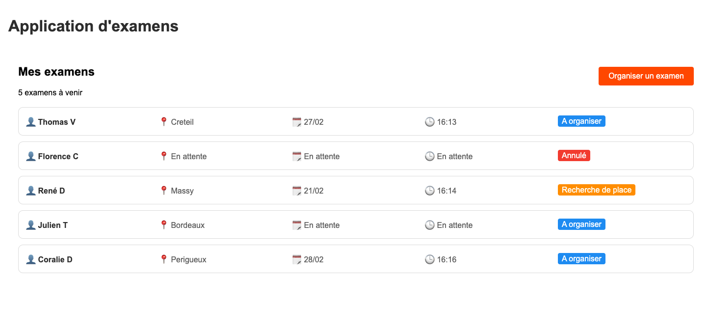
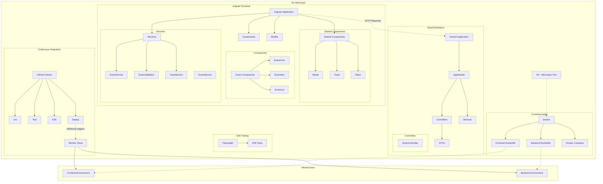
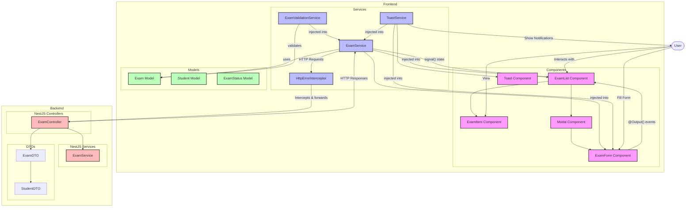

# Test Technique d'En Voiture Simone sur le développement frontend

[](https://github.com/sahnas/evs/actions/workflows/ci.yml)


## Objectif

L'objectif est de créer une application front-end en Angular qui interagit avec un backend Node.js mock.
Le but de ce test sera de servir de base de discussion à l'entretien technique, en proposant un code de qualité.

### Durée estimée

2 à 3 heures

## Instructions

L'objectif est de faire une application minimale de gestions des examens à destination de nos enseignants.

### Fonctionnalités de l'application front-end

1. **Affichage de la liste des examens :**
   - Une page ou une vue qui affiche la liste des items récupérés du serveur via l'endpoint `GET /api/exams`.
2. **Ajout d'un nouvel examen :**
   - Un formulaire ou une interface qui permet d'ajouter un nouvel item via l'endpoint `POST /api/exams`, lors du clic sur le bouton "Organiser un examen".

Le rendu devra s'inspirer du mockup suivant :



### Conteneurisation avec Docker

L'application doit pouvoir être lancée avec une simple commande :

`docker compose up`

Il est suggéré de :

1. **Créer un Dockerfile pour le backend Node.js.**
2. **Créer un Dockerfile pour l'application front-end.**
3. **Utiliser le fichier `docker-compose.yml` fourni pour orchestrer les services :**
   - Un service pour le backend.
   - Un service pour le front-end.

### Aides techniques

3 fichiers sont fournis, pour permettre de se concentrer sur la partie front-end :

- Un swagger qui décrit le format de l'API et les modèles de données. [exam-api.yml](exam-api.yml)
- Le [docker-compose.yml](docker-compose.yml), qui nécessitera les Dockerfile
- Le [server.js](server.js), qui contient un serveur mock.

## Livrable attendus

L'ensemble des fichiers permettant le lancement de l'application via la commande suivante :

`docker compose up`

### Critères d'évaluation

1. **Fonctionnalité :** L'application fonctionne comme attendu et interagit correctement avec le backend.
2. **Modularisation :** Les composants sont bien structurés et modulaires. L'architecture retenue permettra d'ajouter facilement de nouvelles fonctionnalités.
3. **Code propre :** Le code est bien organisé, lisible et facilement compréhensible. En bref, il doit être "production-ready"!
4. **Conteneurisation :** L'application est correctement conteneurisée et peut être lancée avec Docker Compose.

Si vous avez identifié des choses imparfaites dans votre code (par manque de temps par exemple), ajoutez les au README pour qu'on puisse en discuter!

Bonne chance !

## Project Architecture

This project is structured as an NX monorepo allowing management of multiple interdependent applications within a single repository.

## Architecture Overview



## Data Flow and Component Interactions



## Main Component Description

### Monorepo Global Structure

- **NX as Management Tool**: Build orchestration, testing, and deployments with intelligent caching
- **Distinct Applications**: Frontend (Angular) and Backend (NestJS)
- **E2E Tests**: Managed via Playwright
- **CI/CD**: GitHub Actions pipeline for continuous integration and deployment
- **Containerization**: Docker to facilitate deployment and isolate environments

### Angular Frontend

The frontend is a modern Angular application, using component-based architecture with injectable services:

1. **Main Components**:

   - `ExamListComponent`: Displays the list of exams
   - `ExamFormComponent`: Form for creating exams
   - `ExamItemComponent`: Individual exam representation

2. **Shared Components**:

   - `ModalComponent`: Reusable popup
   - `ToastComponent`: User notification
   - `StatusDisplayPipe`: Status transformation for display

3. **Services**:

   - `ExamService`: Manages API calls and exam business logic
   - `ExamValidationService`: Client-side exam data validation
   - `ToastService`: Manages notifications
   - `HttpErrorInterceptor`: Intercepts HTTP errors and displays notifications

4. **Data Models**:
   - TypeScript interfaces for typing data (Exam, Student, ExamStatus)

### NestJS Backend

The backend is a NestJS application with a modular architecture:

1. **Controllers**:

   - `ExamsController`: Handles `/api/exams` routes

2. **Services**:

   - `ExamsService`: Business logic for exams

3. **DTOs and Interfaces**:
   - Incoming data validation
   - Strong data typing

### Data Flow

1. User interacts with the user interface
2. Angular components communicate via `@Input()` properties and `@Output()` events
3. Angular services handle business logic and API calls
4. HTTP requests are intercepted by `HttpErrorInterceptor`
5. NestJS backend processes requests
6. Responses are returned to the frontend
7. Data is displayed via Angular components

### CI/CD and Conditional Deployment

1. Tests and linting are executed via GitHub Actions
2. **Conditional Deployment Logic**:
   - The CI pipeline includes a specialized `detect-changes` job that analyzes which files were modified
   - It tracks changes to specific directories (`front/`, `back/`) and shared configuration files
   - Only the affected services are deployed, optimizing deployment time and resources
   - If shared configuration files are modified (e.g., `package.json`, `nx.json`), both services are redeployed
3. **Deployment Rules**:

   ```yaml
   # Logic used to determine which services to deploy
   if echo "$CHANGED_FILES" | grep -qE "^shared-models/|^packages/|package.json$|pnpm-lock.yaml$|pnpm-workspace.yaml$|nx.json$|docker-compose.yml$"; then
     # Shared files changed, deploy both frontend and backend
     FRONT_AFFECTED=true
     BACK_AFFECTED=true
   else
     if echo "$CHANGED_FILES" | grep -q "^front/"; then
       # Frontend-specific changes
       FRONT_AFFECTED=true
     fi

     if echo "$CHANGED_FILES" | grep -q "^back/"; then
       # Backend-specific changes
       BACK_AFFECTED=true
     fi
   fi
   ```

4. Actual deployment is done on Render Cloud via webhook triggers that are conditionally executed
5. Docker is used to containerize applications with separate Dockerfiles for each service

### Git Hooks with Husky

The project utilizes Husky to enforce code quality at the developer's local environment before code reaches the repository:

1. **Pre-commit Hooks**:

   - Run tests and linting checks before allowing commits
   - Catch issues early in the development cycle
   - Implementation sample:

   ```bash
   pnpm test:all
   pnpm lint:all
   ```

2. **Integration with NX**:

   - Husky hooks are configured to work with NX's affected command capabilities
   - Only tests the projects affected by changes
   - Accelerates the feedback loop for developers

3. **Benefits**:
   - Prevents problematic code from being committed
   - Ensures consistent code quality across the team
   - Reduces the burden on the CI/CD pipeline by addressing issues locally first

## TODO

- [ ] Pagination
